# xboard-theme-lovesy

xboard 主题，前后端分离，简洁、优雅，支持 PC 和 移动端。

## 体验地址

该地址为正式环境，订阅也可直接购买。

[https://www.lovesy.net](https://www.lovesy.net)

## PC 版截图

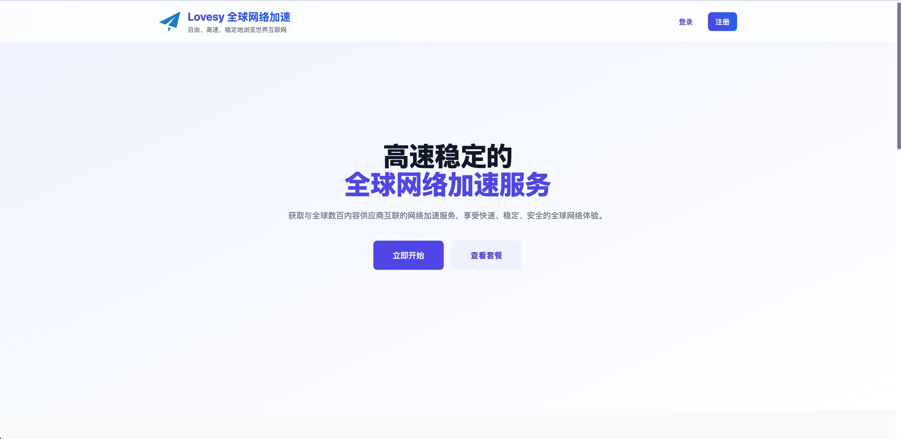
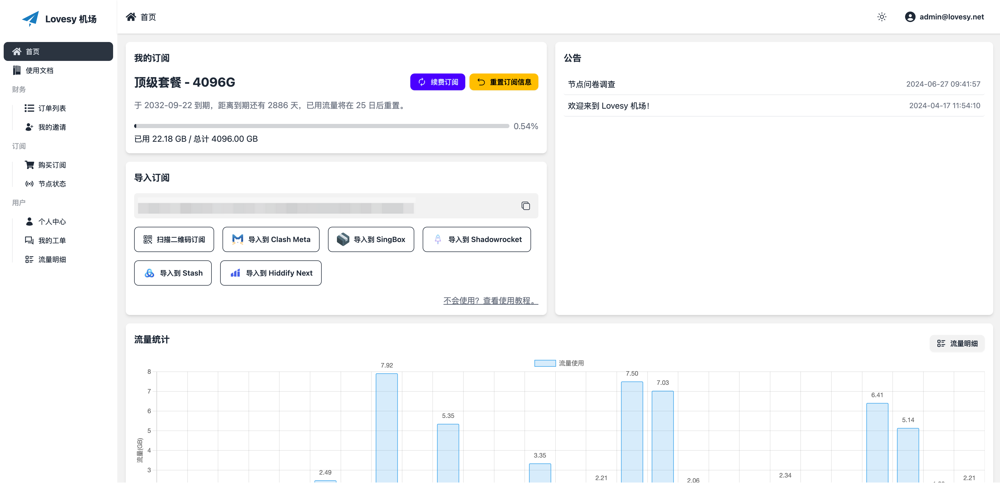
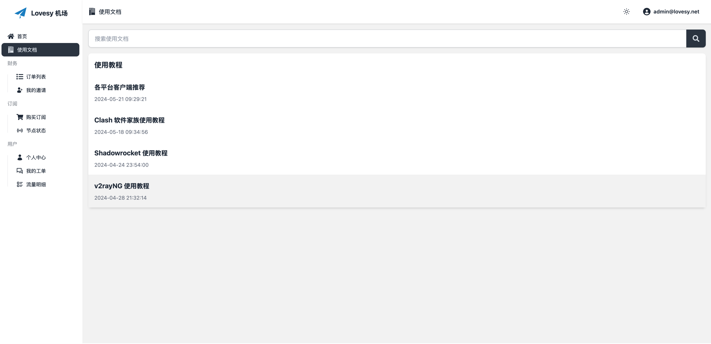

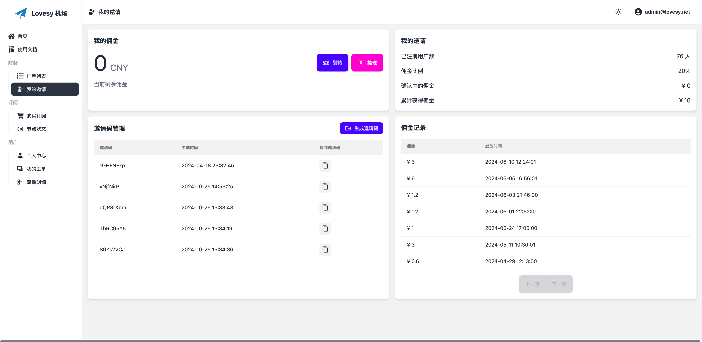
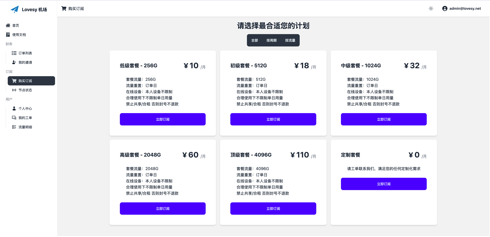
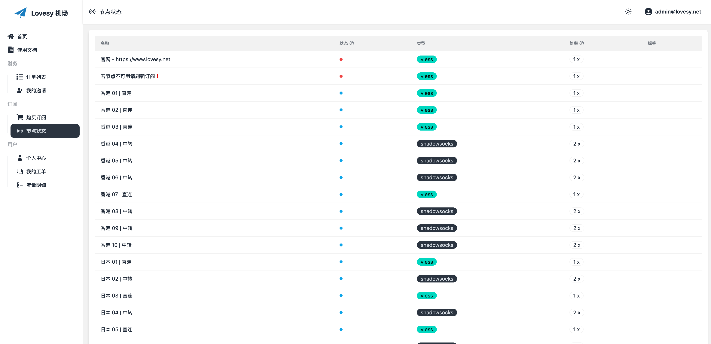
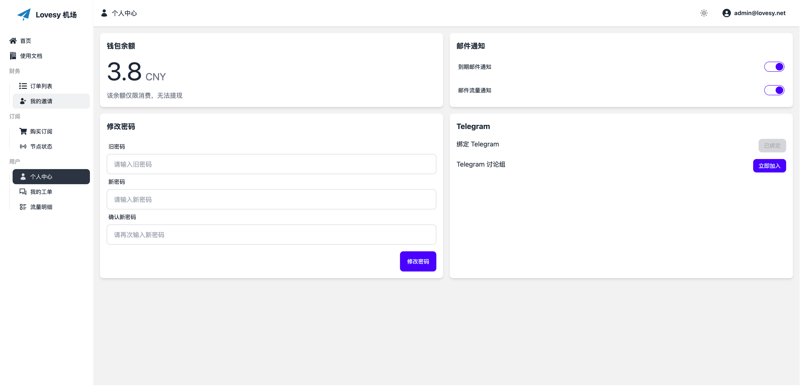
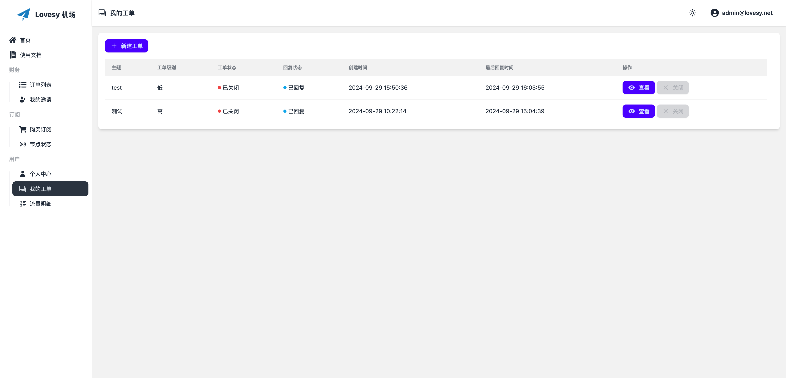
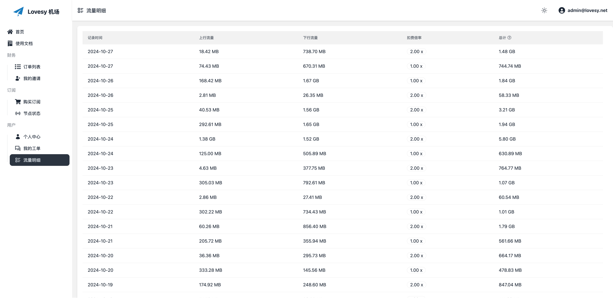

## 移动版截图

| 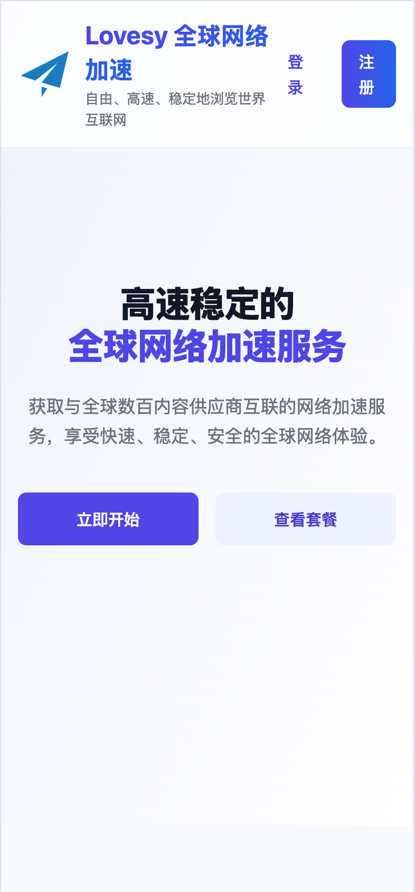 |    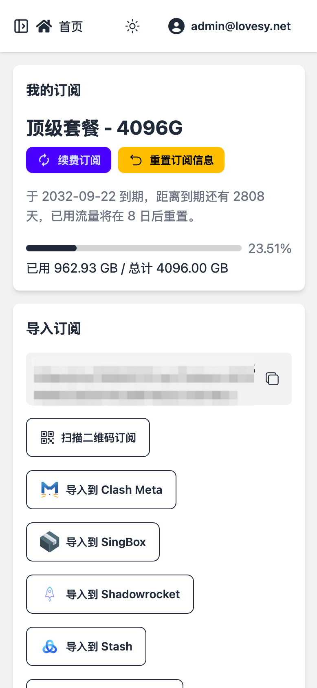    | 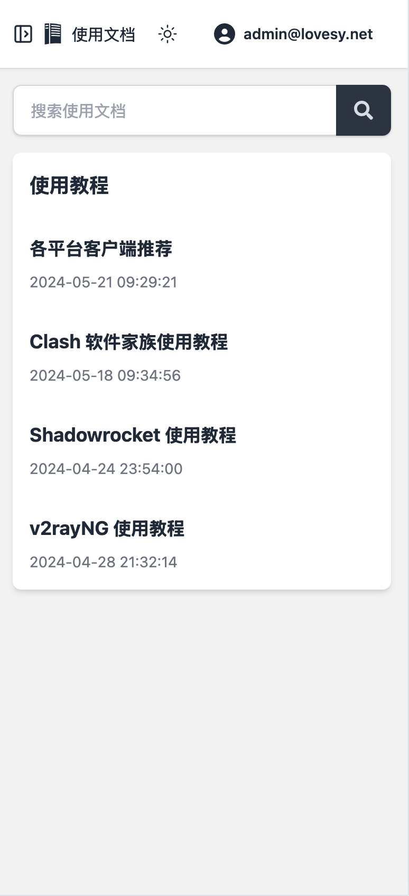 |
| :------------------------------------------: | :------------------------------------------: | :----------------------------------------------: |
|   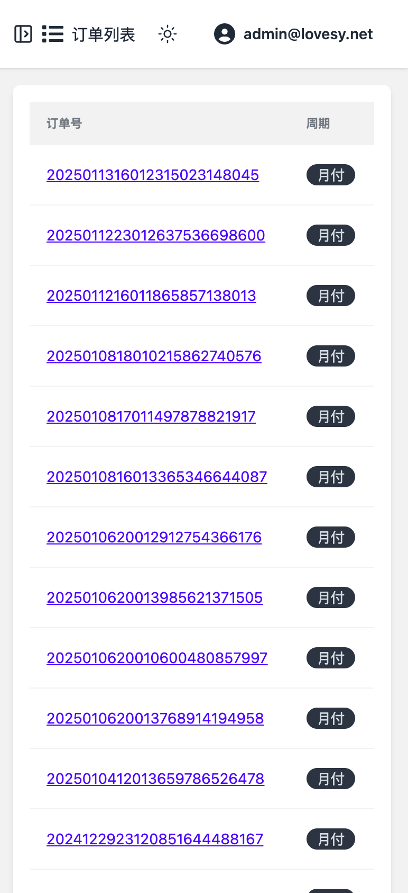   |  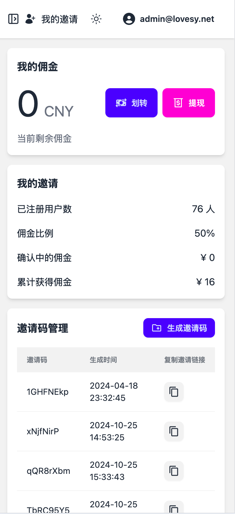  |      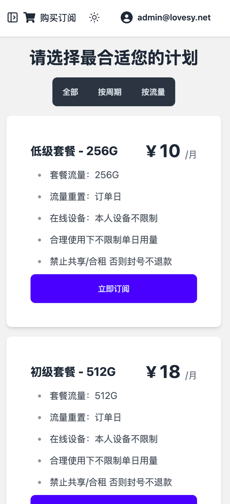      |
|    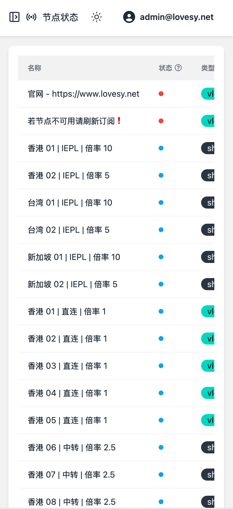    | 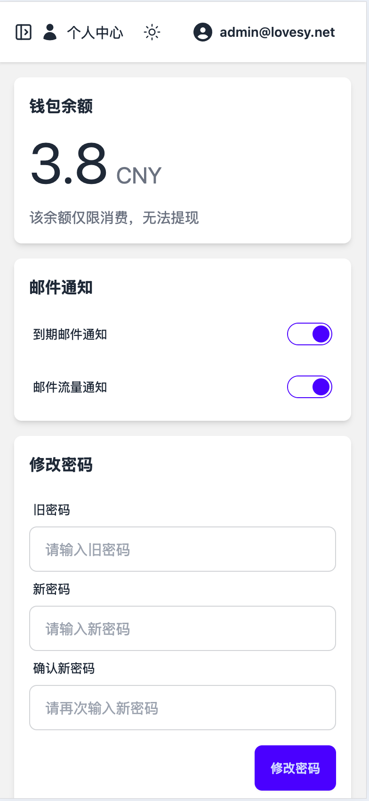 |    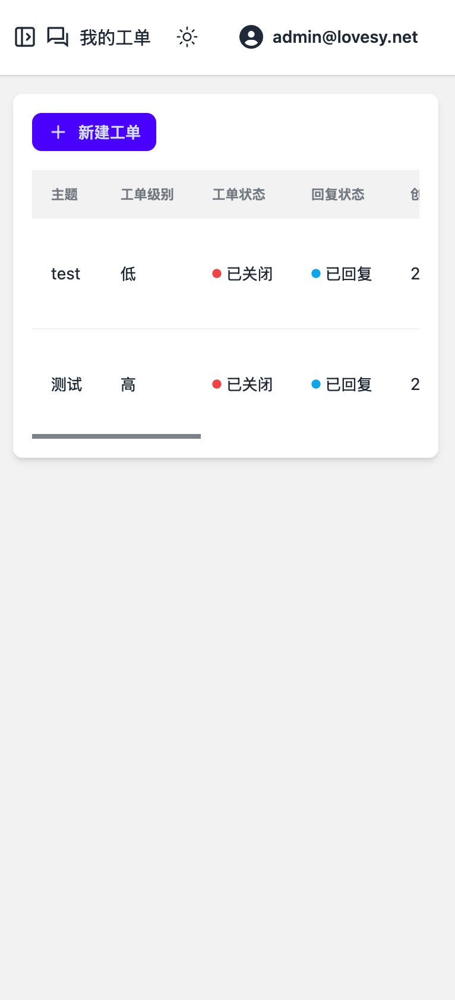    |
| 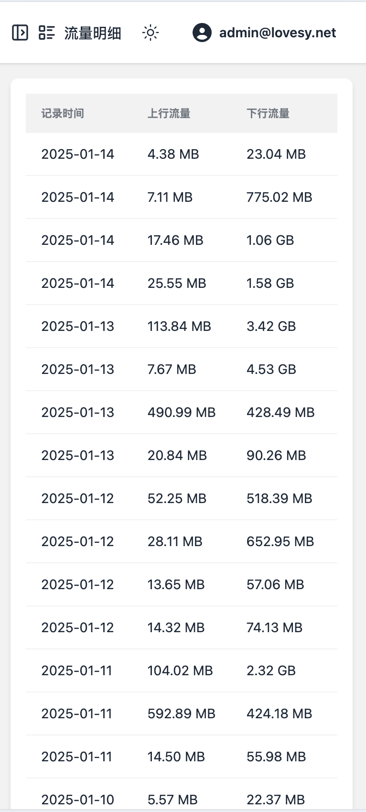 |                                              |                                                  |

## 购买以及定制化开发

- Telegram: [https://t.me/jenlors](https://t.me/jenlors)
